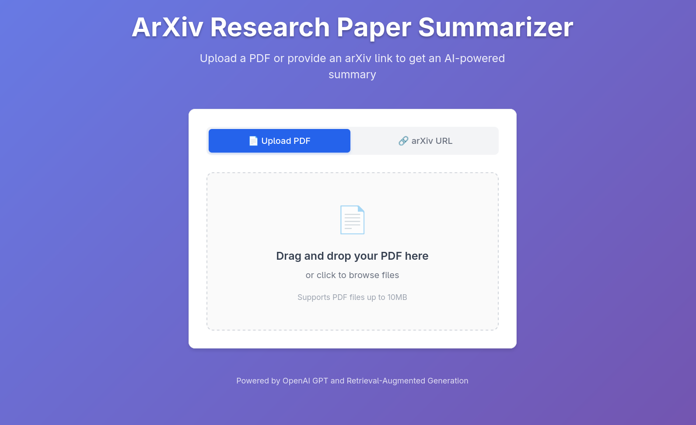

# ArXiv RAG App

AI-powered research paper summarizer using Retrieval-Augmented Generation (RAG) and OpenAI.

## Screenshots

### Upload Interface

*Upload PDFs or paste arXiv URLs to get started*

### Summary Results

*Get comprehensive AI-generated summaries of research papers*

## Quick Start

1. **Install dependencies:**
   ```bash
   npm install
   ```

2. **Add your OpenAI API key:**
   ```bash
   cp backend/.env.example backend/.env
   # Edit backend/.env and add your OPENAI_API_KEY
   ```

3. **Run the app:**
   ```bash
   npm run dev
   ```

Visit http://localhost:5173 to use the app!

## Features

- 📄 Upload PDF research papers
- 🔗 Process arXiv URLs directly  
- 🤖 AI summaries with RAG
- 🎨 Modern drag-and-drop UI

## Tech Stack

- **Frontend**: React + TypeScript + Vite
- **Backend**: Node.js + Express
- **AI**: OpenAI GPT + RAG processing
